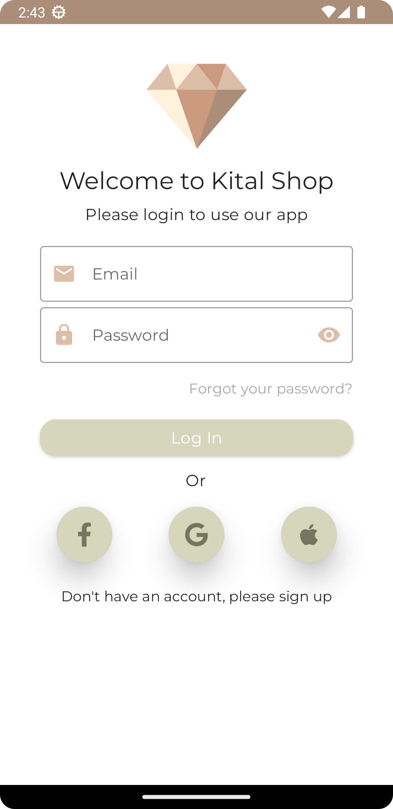
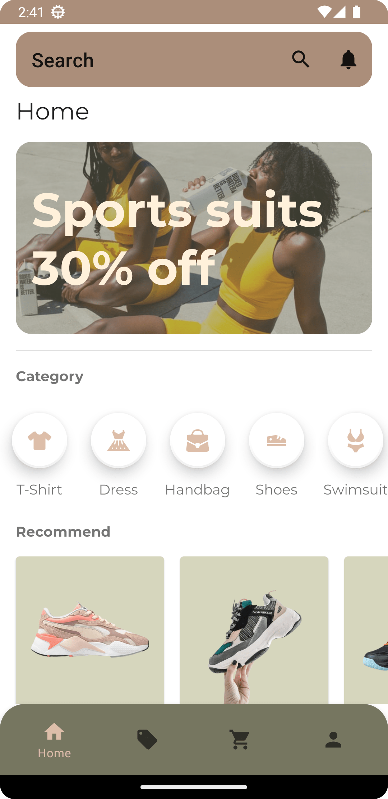
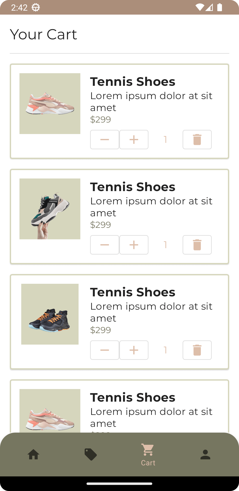

# Kital

Kital es una plantilla de e-commerce enfocada en la venta de ropa y accesorios utilizando Material Design y el API de animaciones Lottie Files. La aplicación cuenta con un login y un bottom bar de 4 opciones: Inicio, Ofertas, Carrito y Perfil.

## Requisitos de sistema

Para utilizar la aplicación Kital, se requiere lo siguiente:

-   Android Studio versión 4.2 o superior
-   SDK de Android versión 28 o superior
-   Librería Material Design
-   API de animaciones Lottie Files

## Instalación

Para instalar la aplicación Kital, sigue estos pasos:

1.  Clona el repositorio en tu computadora:

```bash
git clone https://github.com/DaveDeveloper117/Kital.git
```

2.  Abre el proyecto en Android Studio
3.  Haz clic en "Run" para compilar y ejecutar la aplicación en tu dispositivo o emulador

## Cómo usar la aplicación

Después de instalar Kital, puedes probar las diferentes funciones de la aplicación:

1.  Inicia sesión en la aplicación utilizando las credenciales predeterminadas o crea una nueva cuenta
2.  En el bottom bar de la aplicación, puedes seleccionar diferentes opciones para ver productos o acceder a tu perfil
3.  Selecciona el producto deseadp
4.  Verifica tu carrito 

## Imágenes de demostración

A continuación se muestran algunas imágenes de demostración de la aplicación Kital:

     

## Live Demo

Puedes probar una demo en vivo de Kital en el siguiente enlace: [KitalLiveDemo](https://appetize.io/app/oklmh2jobdienjmfjzvrvk5vde)

## Licencia

Kital se distribuye bajo la Licencia MIT. Para más información, consulta el archivo [LICENSE](https://github.com/DaveDeveloper117/Kital/blob/master/LICENSE) en este repositorio.
